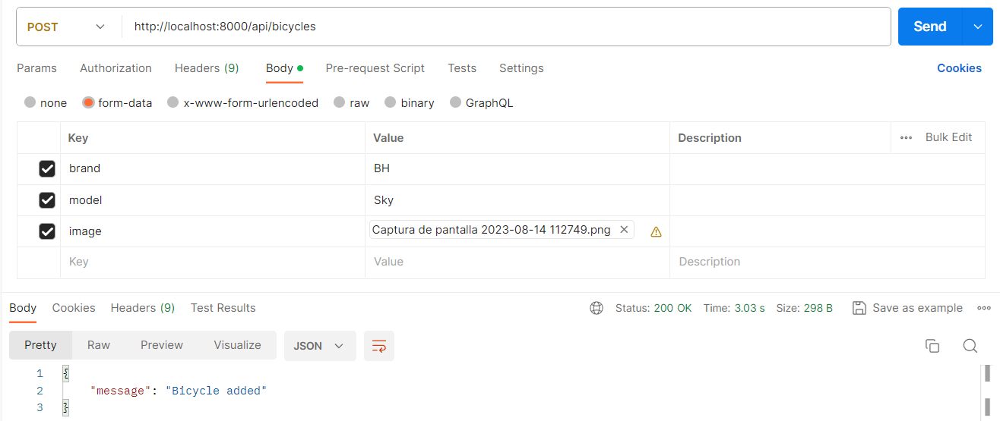
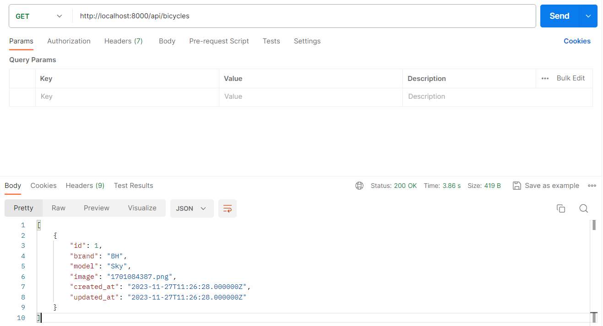

# Laravel 10 API Example to upload/download images

It's just that: An example to upload/download images from Laravel 10 API.

In this example the image will be uploaded to /public/images directory through a POST. After that the image can be downloaded using the URL http://localhost:8000/images/name-of-the-image.png (where name-of-the-image.png is located in the directory /public/images in your Laravel project).

## Getting Started

Just read the tutorial:
https://coderadvise.com/upload-file-or-image-on-laravel-through-rest-api/

### For the most impatient learners

You need a working Laravel environment. You can do it using Laragon for example. In my case I use WSL2 in a Windows 11 machine.

### For the most impatient learners

Clone this project:

````
git clone https://github.com/tcrurav/Laravel10Images.git
````

Create a .env. You can just copy .env.example to .env, and edit the database credentials.

After that create the database in MySQL.

After that execute the following commands:

````
composer install
php artisan migrate
php artisan serve
````

And now try the POSTMAN request to create a bicycle with image:



__________________________________________________________

And now the POSTMAN request to get all bicycles:



__________________________________________________________

Now you can just access the URL image with the name from last screenshot:


__________________________________________________________


Enjoy!!!

### Prerequisites

All you need is... some time and...
* Visual Studio Code.
* Laravel 10.
* PostMan, for the RESTFul tests.
* More hours than you first could think of...

## Built With

* [Visual Studio Code](https://code.visualstudio.com/) - Visual Studio Code Editor.
* [WSL2](https://ubuntu.com/tutorials/install-ubuntu-on-wsl2-on-windows-11-with-gui-support#1-overview) - Install Ubuntu on WSL2 and get started with graphical applications.

## Links you might find interesting

* [Upload File or Image on Laravel Through REST API](https://coderadvise.com/upload-file-or-image-on-laravel-through-rest-api/) - Very simple tutorial this example is based on.
* [Storage, Traits and more...](https://ahmedshaltout.com/laravel/how-to-download-files-from-url-in-laravel-and-save-them-in-the-storage/) - How to Download Files From URL In Laravel And Save them in the Storage.